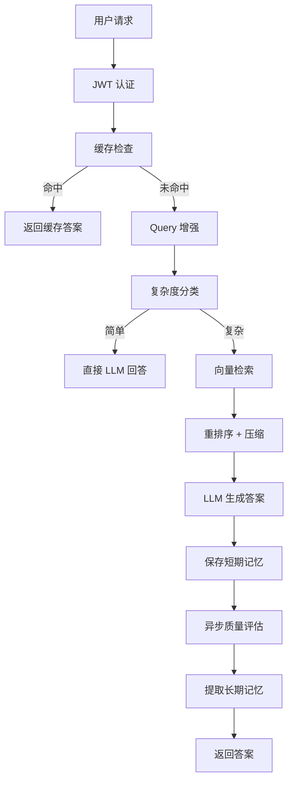
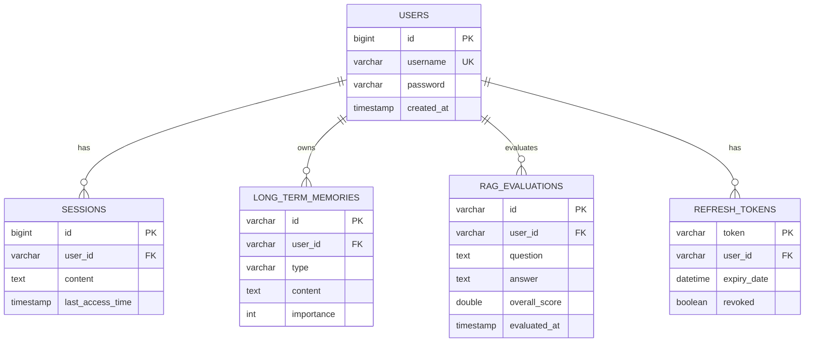

# RAG 智能知识库系统 - 概要设计文档

**文档版本**: v1.0  
**编写日期**: 2026-06-12  
**项目名称**: RAG 智能知识库问答系统

---

## 1. 引言

### 1.1 编写目的
本文档描述 RAG 智能知识库系统的总体架构设计，为详细设计、编码实现和测试提供指导。

### 1.2 项目背景
基于 Spring AI 构建的企业级 RAG（检索增强生成）知识库系统，支持智能问答、记忆管理、质量评估和全方位可观测性。

### 1.3 适用范围
- 系统架构设计
- 模块划分与接口定义
- 技术选型说明
- 部署架构设计

---

## 2. 系统概述

### 2.1 系统目标
1. **智能问答**: 基于向量检索的精准答案生成
2. **记忆管理**: 短期记忆（会话上下文）+ 长期记忆（用户画像）
3. **质量评估**: 自动化评估答案质量（Faithfulness, Relevance）
4. **企业级特性**: 认证授权、性能优化、可观测性、容错机制

### 2.2 用户角色
| 角色 | 权限 | 说明 |
|------|------|------|
| **普通用户** | 问答、查看历史 | 使用 RAG 问答功能 |
| **管理员** | 用户管理、监控 | 管理系统和查看指标 |

---

## 3. 系统架构

### 3.1 技术栈

#### 核心框架
- **Spring Boot**: 3.5.0
- **Spring AI**: 1.0.0
- **Spring Security**: JWT 认证
- **Spring Data JPA**: 数据持久化

#### 数据存储
- **MySQL**: 8.0（用户、记忆、评估结果）
- **Redis**: 7.0（缓存、会话）
- **Milvus**: 2.3（向量数据库）

#### 监控与可观测性
- **Prometheus**: 指标收集
- **Grafana**: 可视化面板
- **Zipkin**: 分布式追踪
- **ELK Stack**: 日志聚合（Filebeat + Elasticsearch + Kibana）

#### 容错与性能
- **Resilience4j**: 熔断、重试、超时
- **Bucket4j**: API 速率限制
- **Caffeine**: 本地缓存

### 3.2 架构分层

```
┌─────────────────────────────────────────┐
│         Presentation Layer              │
│  (API Controllers, Swagger UI)          │
└──────────────┬──────────────────────────┘
               │
┌──────────────▼──────────────────────────┐
│         Business Logic Layer            │
│  (Services, RAG Flow, Memory Manager)   │
└──────────────┬──────────────────────────┘
               │
┌──────────────▼──────────────────────────┐
│         Data Access Layer               │
│  (Repositories, Vector Store, Cache)    │
└──────────────┬──────────────────────────┘
               │
┌──────────────▼──────────────────────────┐
│         Infrastructure Layer            │
│  (MySQL, Redis, Milvus, External APIs)  │
└─────────────────────────────────────────┘
```

### 3.3 模块划分

| 模块 | 职责 | 关键技术 |
|------|------|---------|
| **api** | REST API、认证控制器 | Spring MVC, Swagger |
| **core** | 核心业务逻辑 | Spring AI, Resilience4j |
| **model** | 数据模型、DTO | JPA, Lombok |
| **starter** | 应用启动、配置 | Spring Boot |

---

## 4. 核心业务流程

### 4.1 RAG 问答流程



### 4.2 记忆管理流程

**短期记忆**:
- 存储位置: Redis
- TTL: 30 分钟
- 最大消息数: 20 条
- 用途: 多轮对话上下文

**长期记忆**:
- 存储位置: MySQL
- 触发条件: 每 10 轮对话
- 类型: FACT（事实）、PREFERENCE（偏好）、CONTEXT（上下文）
- 用途: 个性化检索、用户画像

---

## 5. 接口设计

### 5.1 REST API 概览

| 接口 | 方法 | 路径 | 说明 |
|------|------|------|------|
| **认证** | POST | `/api/auth/register` | 用户注册 |
| **认证** | POST | `/api/auth/login` | 用户登录 |
| **认证** | POST | `/api/auth/refresh` | 刷新 Token |
| **问答** | POST | `/api/qa/ask` | RAG 问答 |
| **问答** | GET | `/api/qa/history` | 查询历史 |
| **评估** | GET | `/api/qa/evaluations/statistics` | 评估统计 |
| **监控** | GET | `/api/monitor/threadpool` | 线程池状态 |

### 5.2 核心接口定义

#### 5.2.1 RAG 问答接口

**请求**:
```json
POST /api/qa/ask
Authorization: Bearer {token}

{
  "userId": "user123",
  "question": "什么是 RAG？",
  "source": ["pdf", "markdown"]
}
```

**响应**:
```json
{
  "answer": "RAG 是检索增强生成...",
  "sources": [
    {
      "content": "...",
      "metadata": {
        "source": "document.pdf",
        "page": 5
      }
    }
  ],
  "evaluationId": "eval_001"
}
```

---

## 6. 数据设计

### 6.1 数据库 ER 图



### 6.2 关键索引设计

| 表 | 索引 | 类型 | 用途 |
|----|------|------|------|
| `rag_evaluations` | `idx_user_time` | 联合索引 | 用户评估历史查询 |
| `long_term_memories` | `idx_user_type` | 联合索引 | 按类型查询记忆 |
| `users` | `idx_username` | 唯一索引 | 用户登录验证 |

---

## 7. 安全设计

### 7.1 认证机制
- **JWT Token**: Access Token（24h）+ Refresh Token（7天）
- **密码加密**: BCrypt
- **Token 刷新**: `/api/auth/refresh` 接口

### 7.2 防护措施
- **API 速率限制**: 100 请求/分钟（Bucket4j）
- **SQL 注入防护**: JPA Parameterized Query
- **XSS/CSRF 防护**: Spring Security 默认启用

---

## 8. 性能设计

### 8.1 缓存策略

| 缓存类型 | 存储 | TTL | 命中率预期 |
|---------|------|-----|-----------|
| 问答结果 | Redis | 1 小时 | 30-50% |
| 会话消息 | Redis | 30 分钟 | N/A |
| Query 增强 | Caffeine | 10 分钟 | 80% |

### 8.2 线程池隔离

| 线程池 | 核心线程 | 最大线程 | 队列容量 | 用途 |
|--------|---------|---------|---------|------|
| ragRetrievalExecutor | 5 | 10 | 100 | 向量检索 |
| llmCallExecutor | 3 | 6 | 50 | LLM 调用 |

---

## 9. 可观测性设计

### 9.1 监控指标
- **JVM 指标**: 内存、GC、线程
- **HTTP 指标**: 请求数、延迟、错误率
- **业务指标**: 缓存命中率、LLM 调用次数、RAG 响应时间

### 9.2 告警规则
1. ApplicationDown: 应用下线 > 1min
2. HighErrorRate: 5xx 错误率 > 5%
3. HighLatency: P95 延迟 > 5s
4. HighMemoryUsage: JVM 堆内存 > 85%

---

## 10. 部署架构

### 10.1 Docker Compose 服务

| 服务 | 端口 | 说明 |
|------|------|------|
| 应用 | 8080 | RAG API |
| Grafana | 3000 | 监控面板 |
| Prometheus | 9090 | 指标收集 |
| Zipkin | 9411 | 分布式追踪 |
| Kibana | 5601 | 日志搜索 |
| Redis | 6379 | 缓存 |
| MySQL | 3306 | 数据库 |

### 10.2 网络拓扑

```
客户端 → Nginx (HTTPS) → 应用集群
                           ↓
                    Redis Cluster
                    MySQL Master-Slave
                    Milvus Cluster
```

---

## 11. 附录

### 11.1 术语表
- **RAG**: Retrieval-Augmented Generation（检索增强生成）
- **MMR**: Maximal Marginal Relevance（最大边界相关性）
- **CRAG**: Corrective RAG（修正型 RAG）

### 11.2 参考文档
- [详细设计文档](详细设计.md)
- [部署指南](部署指南.md)

---

**文档结束**
