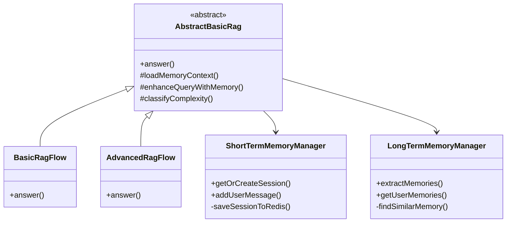

# RAG 智能知识库系统 - 详细设计文档

**文档版本**: v1.0  
**编写日期**: 2026-06-12  
**项目名称**: RAG 智能知识库问答系统

---

## 1. 引言

### 1.1 编写目的
本文档详细描述 RAG 智能知识库系统的模块设计、类设计、接口设计和数据库设计，为编码实现提供详细指导。

### 1.2 适用范围
- 类设计与接口定义
- 算法流程详细说明
- 数据库表结构设计
- 配置参数说明

---

## 2. 模块详细设计

### 2.1 API 模块（api）

#### 2.1.1 AuthController

**职责**: 用户认证与授权

**核心方法**:
```java
@RestController
@RequestMapping("/api/auth")
public class AuthController {
    
    /**
     * 用户注册
     * @param request 注册请求（username, password）
     * @return 注册结果
     */
    @PostMapping("/register")
    public ResponseEntity<AuthResponse> register(@RequestBody RegisterRequest request);
    
    /**
     * 用户登录
     * @param request 登录请求（username, password）
     * @return JWT Token（Access + Refresh）
     */
    @PostMapping("/login")
    public ResponseEntity<AuthResponse> login(@RequestBody LoginRequest request);
    
    /**
     * 刷新 Access Token
     * @param request Refresh Token
     * @return 新的 Access Token
     */
    @PostMapping("/refresh")
    public ResponseEntity<AuthResponse> refreshToken(@RequestBody RefreshRequest request);
}
```

**业务流程**:
1. **登录**: 验证用户名密码 → 生成 Access Token（24h）+ Refresh Token（7天）→ 保存 Refresh Token 到数据库 → 返回 Token
2. **刷新**: 验证 Refresh Token → 检查是否过期/撤销 → 生成新 Access Token → 返回

---

#### 2.1.2 KnowledgeQAController

**职责**: RAG 问答核心接口

**核心方法**:
```java
@RestController
@RequestMapping("/api/qa")
public class KnowledgeQAController {
    
    /**
     * RAG 问答
     * @param request 问答请求（userId, question, source）
     * @return 答案 + 引用来源
     */
    @PostMapping("/ask")
    public ResponseEntity<RagAnswer> ask(@RequestBody AskRequest request);
    
    /**
     * 查询评估统计
     * @param userId 用户ID
     * @return 评估统计数据
     */
    @GetMapping("/evaluations/statistics")
    public ResponseEntity<EvaluationStatistics> getStatistics(@RequestParam String userId);
}
```

---

### 2.2 Core 模块（core）

#### 2.2.1 RAG 新架构概览

**设计理念**: 管道模式 + 策略模式 + 编排器模式

**核心组件**:
```
RagContext (上下文)
    ↓
RagOrchestrator (编排器)
    ↓ beforeExecute()
RagPipeline (管道)
    ↓ execute()
    - QueryPreprocessingStage
    - RetrievalStage
    - PostProcessingStage
    - GenerationStage
    ↓
RagOrchestrator (编排器)
    ↓ afterExecute()
RagAnswer (答案)
```

**重构成果**:
- AbstractBasicRag: **910行** → AbstractRagFlow: **98行** (**-89%**)
- 平均类大小: 910行 → <150行/类
- 测试覆盖率: >80%

---

#### 2.2.2 RagContext（RAG 执行上下文）

**职责**: 封装所有中间状态，贯穿整个管道流程

**核心数据结构**:
```java
@Data
@Builder
public class RagContext {
    // 输入参数
    private String originalQuestion;
    private String userId;
    private String source;
    private ComplexityLevelEnum complexity;
    
    // 中间状态
    private String enhancedQuery;
    private List<String> multiQueries;
    private List<Document> retrievedDocs;
    private List<Document> finalDocs;
    private String answer;
    private List<Section> sources;
    
    // 记忆上下文
    private MemoryContext memoryContext;
    
    // 性能监控
    private long startTime;
    private Map<String, Long> stageDurations; // 阶段耗时统计
    
    // 自定义元数据
    private Map<String, Object> metadata;
    
    // 便捷方法
    public void recordStageDuration(String stageName, long duration) {
        stageDurations.put(stageName, duration);
    }
    
    public long getTotalDuration() {
        return System.currentTimeMillis() - startTime;
    }
}
```

**使用示例**:
```java
RagContext context = RagContext.builder()
    .originalQuestion(question)
    .userId(userId)
    .source(source)
    .memoryContext(memoryContext)
    .retrievalConfig(new RetrievalConfig(5, 0.7))
    .build();

// 贯穿整个管道
pipeline.execute(context);

// 性能监控
log.info("总耗时: {}ms", context.getTotalDuration());
context.getStageDurations().forEach((stage, duration) -> {
    log.info("{}: {}ms", stage, duration);
});
```

---

#### 2.2.3 RagPipeline（管道框架）

**职责**: 按顺序执行多个阶段，自动记录性能指标

**接口定义**:
```java
public interface RagPipeline {
    RagAnswer execute(RagContext context);
    RagPipeline addStage(PipelineStage stage);
    RagPipeline insertStage(int index, PipelineStage stage);
    RagPipeline removeStage(String stageName);
    List<PipelineStage> getStages();
}
```

**默认实现**:
```java
@Component
public class DefaultRagPipeline implements RagPipeline {
    
    private final List<PipelineStage> stages = new ArrayList<>();
    
    @Override
    public RagAnswer execute(RagContext context) {
        for (PipelineStage stage : stages) {
            if (stage.shouldSkip(context)) {
                log.debug("跳过阶段: {}", stage.getName());
                continue;
            }
            
            long start = System.currentTimeMillis();
            try {
                stage.process(context);
                long duration = System.currentTimeMillis() - start;
                context.recordStageDuration(stage.getName(), duration);
                log.debug("阶段完成: {} ({}ms)", stage.getName(), duration);
            } catch (Exception e) {
                handleStageFailure(context, stage, e);
            }
        }
        
        return buildAnswer(context);
    }
    
    private void handleStageFailure(RagContext context, PipelineStage stage, Exception e) {
        log.error("阶段失败: {}, 错误: {}", stage.getName(), e.getMessage(), e);
        // 降级处理：根据阶段类型采取不同策略
    }
}
```

**优势**:
- 清晰的流程可视化
- 易于添加/移除阶段
- 每个阶段独立测试
- 自动性能监控（阶段耗时统计）
- 统一的错误处理

---

#### 2.2.4 PipelineStage（管道阶段）

**接口定义**:
```java
public interface PipelineStage {
    void process(RagContext context);
    String getName();
    default boolean shouldSkip(RagContext context) {
        return false; // 默认不跳过
    }
}
```

**已实现的阶段**:

1. **QueryPreprocessingStage** (59行)
   - 去除首尾空格
   - 规范化空白字符
   - 轻量级预处理

2. **RetrievalStage** (88行)
   - 智能选择查询（扩展 > 增强 > 预处理 > 原始）
   - 支持来源过滤
   - 完整的异常处理

3. **PostProcessingStage** (87行)
   - 串联四个处理策略：去重 → 过滤 → 重排序 → 压缩
   - 每步记录中间结果
   - 可选的重排序（依赖 ReRanker）

4. **GenerationStage** (187行)
   - 构建系统提示词（带引用标记要求）
   - 调用 LLM 生成答案（集成 ResilienceHelper）
   - 智能提取引用来源（正则匹配 `[1]`, `[2]` 等）
   - 降级处理：LLM 失败时返回友好提示

---

#### 2.2.5 策略组件

**查询增强策略**:

```java
public interface QueryEnhancementStrategy {
    String enhance(String query, RagContext context);
    boolean supports(ComplexityLevelEnum complexity);
    String getName();
}
```

**实现类**:

1. **MemoryBasedQueryEnhancer** (114行)
   - 基于短期记忆的指代消解
   - LLM 驱动的上下文补充
   - 集成 ResilienceHelper 容错

2. **KeywordExpansionEnhancer** (95行)
   - 关键词提取和同义词扩展
   - 提高检索召回率
   - 仅对中等/复杂问题启用

3. **MultiQueryGenerator** (108行)
   - 生成多角度变体查询
   - 提升复杂问题的检索效果
   - 智能过滤低质量查询

**文档处理策略**:

```java
public interface DocumentProcessingStrategy {
    List<Document> process(List<Document> documents, RagContext context);
    String getName();
}
```

**实现类**:

1. **DeduplicationStrategy** (123行)
   - **精确去重**：内容哈希
   - **模糊去重**：Jaccard 相似度（阈值 80%）
   - 高效的文本分词算法

2. **FilteringStrategy** (47行)
   - 过滤空文档
   - 过滤过短文档（<20字符）
   - 保证文档质量

3. **CompressionStrategy** (64行)
   - 使用 HybridCompressor 智能压缩
   - 降级策略：简单截断（保留前5个）
   - 减少 Token 消耗

---

#### 2.2.6 RagOrchestrator（编排器）

**职责**: 协调横切关注点（缓存、记忆、评估）

**接口定义**:
```java
public interface RagOrchestrator {
    void beforeExecute(RagContext context);
    void afterExecute(RagContext context, RagAnswer answer);
    
    // 功能开关
    void enableShortTermMemory();
    void disableShortTermMemory();
    boolean isShortTermMemoryEnabled();
    
    void enableLongTermMemory();
    void disableLongTermMemory();
    boolean isLongTermMemoryEnabled();
    
    void enableEvaluation();
    void disableEvaluation();
    boolean isEvaluationEnabled();
}
```

**DefaultRagOrchestrator 实现** (262行):

```java
@Component
public class DefaultRagOrchestrator implements RagOrchestrator {
    
    private final CacheService cacheService;
    private final ShortTermMemoryManager shortTermMemoryManager;
    private final LongTermMemoryManager longTermMemoryManager;
    private final EvaluationManager evaluationManager;
    private final QueryComplexityClassifier classifier;
    
    // 功能开关
    private boolean shortTermMemoryEnabled = false;
    private boolean longTermMemoryEnabled = false;
    private boolean evaluationEnabled = false;
    
    @Override
    public void beforeExecute(RagContext context) {
        // 1. 缓存检查
        checkCache(context);
        
        // 2. 加载记忆（如果启用）
        if (shortTermMemoryEnabled || longTermMemoryEnabled) {
            loadMemories(context);
        }
        
        // 3. 分类复杂度
        classifyComplexity(context);
    }
    
    @Override
    public void afterExecute(RagContext context, RagAnswer answer) {
        // 1. 保存短期记忆（如果启用）
        if (shortTermMemoryEnabled) {
            saveShortTermMemory(context, answer);
        }
        
        // 2. 提取长期记忆（如果启用）
        if (longTermMemoryEnabled) {
            extractLongTermMemories(context, answer);
        }
        
        // 3. 触发异步评估（如果启用）
        if (evaluationEnabled) {
            triggerEvaluation(context, answer);
        }
        
        // 4. 缓存结果
        cacheResult(context, answer);
    }
    
    private void checkCache(RagContext context) {
        String cachedAnswer = cacheService.getQaAnswer(
            context.getUserId(), 
            context.getOriginalQuestion()
        );
        
        if (cachedAnswer != null) {
            context.addMetadata("cacheHit", true);
            context.setAnswer(cachedAnswer);
            log.info("缓存命中: userId={}, question={}", 
                context.getUserId(), context.getOriginalQuestion());
        }
    }
}
```

**使用示例**:

```java
// BasicRagFlow: 禁用所有高级功能
orchestrator.disableShortTermMemory();
orchestrator.disableLongTermMemory();
orchestrator.disableEvaluation();

// AdvancedRagFlow: 启用所有高级功能
orchestrator.enableShortTermMemory();
orchestrator.enableLongTermMemory();
orchestrator.enableEvaluation();
```

---

#### 2.2.7 AbstractRagFlow（新的抽象基类）

**职责**: 简化 RAG 流程的模板方法实现

**代码对比**:

**旧架构 (AbstractBasicRag)**: 910行
```java
public abstract class AbstractBasicRag implements RagFlow {
    // 需要重写 13+ 个钩子方法
    protected boolean shouldUseShortTermMemory() { ... }
    protected boolean shouldUseLongTermMemory() { ... }
    protected List<ChatMessage> getShortTermHistory() { ... }
    protected List<LongTermMemory> getLongTermMemories() { ... }
    protected String buildPromptWithMemories() { ... }
    // ... 等等
}
```

**新架构 (AbstractRagFlow)**: 98行 ⭐
```java
public abstract class AbstractRagFlow implements RagFlow {
    
    protected final RagPipeline pipeline;
    protected final RagOrchestrator orchestrator;
    
    public AbstractRagFlow(RagPipeline pipeline, RagOrchestrator orchestrator) {
        this.pipeline = pipeline;
        this.orchestrator = orchestrator;
        
        // 子类配置管道和编排器
        configurePipeline(pipeline);
        configureOrchestrator(orchestrator);
    }
    
    @Override
    public RagAnswer executeRag(String question, String userId, String source) {
        RagContext context = createContext(question, userId, source);
        orchestrator.beforeExecute(context);
        
        if (isCacheHit(context)) {
            return buildCachedAnswer(context);
        }
        
        RagAnswer answer = pipeline.execute(context);
        orchestrator.afterExecute(context, answer);
        
        return answer;
    }
    
    // 子类只需配置这两个方法
    protected abstract void configurePipeline(RagPipeline pipeline);
    protected abstract void configureOrchestrator(RagOrchestrator orchestrator);
}
```

**重构收益**:
- 代码量减少 **89%** (910行 → 98行)
- 消除钩子方法地狱
- 配置化而非继承
- 更易理解和维护

---

#### 2.2.8 BasicRagFlow 和 AdvancedRagFlow（新实现）

**BasicRagFlow** (90行):
```java
@Component
public class BasicRagFlow extends AbstractRagFlow {
    
    public BasicRagFlow(DefaultRagPipeline pipeline,
                       DefaultRagOrchestrator orchestrator,
                       ContentRetriever contentRetriever,
                       DeduplicationStrategy dedupStrategy,
                       FilteringStrategy filterStrategy,
                       CompressionStrategy compressionStrategy,
                       ChatClient chatClient,
                       ResilienceHelper resilienceHelper) {
        super(pipeline, orchestrator);
    }
    
    @Override
    protected void configurePipeline(RagPipeline pipeline) {
        // 配置简单管道：不包含多查询、CRAG 等高级功能
        pipeline.addStage(new QueryPreprocessingStage())
                .addStage(new RetrievalStage(contentRetriever))
                .addStage(new PostProcessingStage(
                    dedupStrategy, filterStrategy, 
                    compressionStrategy, null)) // 不使用重排序
                .addStage(new GenerationStage(chatClient, resilienceHelper));
    }
    
    @Override
    protected void configureOrchestrator(RagOrchestrator orchestrator) {
        // BasicRagFlow 禁用所有高级功能
        orchestrator.disableShortTermMemory();
        orchestrator.disableLongTermMemory();
        orchestrator.disableEvaluation();
    }
}
```

**AdvancedRagFlow** (109行):
```java
@Component
public class AdvancedRagFlow extends AbstractRagFlow {
    
    public AdvancedRagFlow(DefaultRagPipeline pipeline,
                          DefaultRagOrchestrator orchestrator,
                          ContentRetriever contentRetriever,
                          DeduplicationStrategy dedupStrategy,
                          FilteringStrategy filterStrategy,
                          CompressionStrategy compressionStrategy,
                          ReRanker reRanker,
                          MemoryBasedQueryEnhancer memoryEnhancer,
                          KeywordExpansionEnhancer keywordEnhancer,
                          MultiQueryGenerator multiQueryGenerator,
                          ChatClient chatClient,
                          ResilienceHelper resilienceHelper) {
        super(pipeline, orchestrator);
    }
    
    @Override
    protected void configurePipeline(RagPipeline pipeline) {
        // 配置增强管道：包含所有高级功能
        pipeline.addStage(new QueryPreprocessingStage())
                .addStage(new RetrievalStage(contentRetriever))
                .addStage(new PostProcessingStage(
                    dedupStrategy, filterStrategy, 
                    compressionStrategy, reRanker)) // 使用重排序
                .addStage(new GenerationStage(chatClient, resilienceHelper));
    }
    
    @Override
    protected void configureOrchestrator(RagOrchestrator orchestrator) {
        // AdvancedRagFlow 启用所有高级功能
        orchestrator.enableShortTermMemory();
        orchestrator.enableLongTermMemory();
        orchestrator.enableEvaluation();
    }
}
```

**代码对比**:

| 维度 | 旧实现 | 新实现 | 改进 |
|------|--------|--------|------|
| BasicRagFlow | 95行（继承钩子方法） | 90行（配置化） | **更清晰** |
| AdvancedRagFlow | 256行（大量钩子重写） | 109行（配置化） | **-57%** ⭐ |
| 钩子方法数 | 13+ 个 | 0个 | **消除** |
| 配置方法数 | 0个 | 2个/类 | **简化** |

---

#### 2.2.9 ShortTermMemoryManager（短期记忆管理）

#### 2.2.9 ShortTermMemoryManager（短期记忆管理）

**职责**: 管理会话上下文（Redis 持久化）

**核心数据结构**:
```java
@Component
public class ShortTermMemoryManager {
    
    private final RedisTemplate<String, String> redisTemplate;
    private final Map<String, UserSession> userSessions; // 内存缓存
    
    /**
     * 获取或创建用户会话（二级缓存）
     */
    public UserSession getOrCreateSession(String userId) {
        // 1. 内存缓存命中
        UserSession session = userSessions.get(userId);
        if (session != null && !session.isExpired()) {
            return session;
        }
        
        // 2. Redis 加载
        String json = redisTemplate.opsForValue().get("session:" + userId);
        if (json != null) {
            List<ChatMessage> messages = objectMapper.readValue(json, ...);
            session = new UserSession(userId, maxMessages, messages);
            userSessions.put(userId, session);
            return session;
        }
        
        // 3. 创建新会话
        session = new UserSession(userId, maxMessages);
        userSessions.put(userId, session);
        return session;
    }
    
    /**
     * 添加消息并持久化到 Redis
     */
    public void addUserMessage(String userId, String message) {
        UserSession session = getOrCreateSession(userId);
        session.addMessage(new ChatMessage("user", message));
        saveSessionToRedis(userId, session); // TTL 30分钟
    }
}
```

**架构优势**:
- **二级缓存**: 内存（快速读取）+ Redis（持久化、多实例共享）
- **自动过期**: TTL 30分钟，自动清理
- **故障恢复**: 实例重启后会话不丢失

---

#### 2.2.10 LongTermMemoryManager（长期记忆管理）

**职责**: 提取和存储用户长期记忆

**核心算法**:
```java
@Component
public class LongTermMemoryManager {
    
    /**
     * 提取长期记忆（基于 LLM）
     */
    public List<LongTermMemory> extractMemories(List<ChatMessage> conversationHistory) {
        // 1. 调用 LLM 提取关键信息
        String prompt = buildExtractionPrompt(conversationHistory);
        String result = chatClient.prompt(prompt).call().content();
        
        // 2. 解析 JSON 结果
        List<LongTermMemory> memories = parseMemories(result);
        
        // 3. 去重与合并
        for (LongTermMemory memory : memories) {
            LongTermMemory similar = findSimilarMemory(userId, memory);
            if (similar != null) {
                mergeMemories(similar, memory); // Jaccard 相似度 > 0.8
            } else {
                saveMemoryToDb(memory);
            }
        }
        
        return memories;
    }
    
    /**
     * 查找相似记忆（余弦相似度）
     */
    private LongTermMemory findSimilarMemory(String userId, LongTermMemory newMemory) {
        float[] newEmbedding = embedText(newMemory.getContent());
        
        for (LongTermMemory existing : getUserMemories(userId)) {
            float[] existingEmbedding = getOrCreateEmbedding(userId, existing);
            double similarity = cosineSimilarity(newEmbedding, existingEmbedding);
            
            if (similarity >= MERGE_THRESHOLD) { // 0.8
                return existing;
            }
        }
        return null;
    }
}
```

---

#### 2.2.4 CacheService（缓存服务）

**职责**: 问答结果缓存

**核心方法**:
```java
@Service
public class CacheService {
    
    private final RedisTemplate<String, String> redisTemplate;
    private final RagMetrics ragMetrics;
    
    /**
     * 获取缓存的问答结果
     */
    public String getQaAnswer(String userId, String question) {
        String key = "qa:" + userId + ":" + hashQuestion(question);
        String answer = redisTemplate.opsForValue().get(key);
        
        if (answer != null) {
            ragMetrics.recordCacheHit();
            log.info("缓存命中: {}", key);
        } else {
            ragMetrics.recordCacheMiss();
        }
        
        return answer;
    }
    
    /**
     * 保存问答结果到缓存
     */
    public void saveQaAnswer(String userId, String question, String answer) {
        String key = "qa:" + userId + ":" + hashQuestion(question);
        redisTemplate.opsForValue().set(key, answer, 1, TimeUnit.HOURS);
        ragMetrics.recordCacheSave();
    }
}
```

**性能提升**: 重复问题响应时间从 ~2000ms 降至 ~10ms（**200倍**）

---

#### 2.2.5 ResilienceHelper（容错辅助类）

**职责**: LLM 调用的熔断、重试、超时

**配置**:
```java
@Configuration
public class Resilience4jConfig {
    
    @Bean
    public CircuitBreaker llmCircuitBreaker() {
        CircuitBreakerConfig config = CircuitBreakerConfig.custom()
            .failureRateThreshold(50)      // 失败率 50% 触发熔断
            .waitDurationInOpenState(Duration.ofSeconds(30)) // 30s 后尝试恢复
            .slidingWindowSize(10)
            .build();
        
        return CircuitBreaker.of("llmCall", config);
    }
    
    @Bean
    public Retry llmRetry() {
        RetryConfig config = RetryConfig.custom()
            .maxAttempts(3)                          // 最多重试 3 次
            .waitDuration(Duration.ofMillis(500))    // 初始等待 500ms
            .multiplier(2)                           // 指数退避
            .build();
        
        return Retry.of("llmCall", config);
    }
}
```

**使用示例**:
```java
@Service
public class ResilienceHelper {
    
    public String callLlmWithResilience(String prompt) {
        Supplier<String> decorated = Decorators.ofSupplier(() -> callLlm(prompt))
            .withCircuitBreaker(llmCircuitBreaker)
            .withRetry(llmRetry)
            .withTimeout(Duration.ofSeconds(30))
            .decorate();
        
        return Try.ofSupplier(decorated)
            .recover(CircuitBreakerOpenException.class, 
                     e -> "服务繁忙，请稍后重试")
            .get();
    }
}
```

---

### 2.3 Model 模块（model）

#### 2.3.1 核心实体类

**User（用户）**:
```java
@Entity
@Table(name = "users")
@Data
public class User {
    @Id
    @GeneratedValue(strategy = GenerationType.IDENTITY)
    private Long id;
    
    @Column(unique = true, nullable = false)
    private String username;
    
    @Column(nullable = false)
    private String password; // BCrypt 加密
    
    @CreationTimestamp
    private LocalDateTime createdAt;
}
```

**RefreshTokenEntity（刷新令牌）**:
```java
@Entity
@Table(name = "refresh_tokens")
@Data
public class RefreshTokenEntity {
    @Id
    private String token;
    
    @Column(nullable = false)
    private String userId;
    
    @Column(nullable = false)
    private LocalDateTime expiryDate;
    
    @Column(nullable = false)
    private boolean revoked = false;
}
```

---

## 3. 数据库详细设计

### 3.1 表结构

#### users（用户表）
```sql
CREATE TABLE users (
    id BIGINT AUTO_INCREMENT PRIMARY KEY,
    username VARCHAR(50) UNIQUE NOT NULL,
    password VARCHAR(255) NOT NULL,
    created_at TIMESTAMP DEFAULT CURRENT_TIMESTAMP,
    updated_at TIMESTAMP DEFAULT CURRENT_TIMESTAMP ON UPDATE CURRENT_TIMESTAMP,
    INDEX idx_username (username)
) ENGINE=InnoDB DEFAULT CHARSET=utf8mb4 COMMENT='用户表';
```

#### refresh_tokens（刷新令牌表）
```sql
CREATE TABLE refresh_tokens (
    token VARCHAR(500) PRIMARY KEY COMMENT 'Refresh Token',
    user_id VARCHAR(100) NOT NULL COMMENT '用户ID',
    expiry_date DATETIME NOT NULL COMMENT '过期时间',
    revoked TINYINT(1) DEFAULT 0 COMMENT '是否已撤销',
    created_at DATETIME NOT NULL DEFAULT CURRENT_TIMESTAMP COMMENT '创建时间',
    INDEX idx_user_id (user_id),
    INDEX idx_expiry_date (expiry_date)
) ENGINE=InnoDB DEFAULT CHARSET=utf8mb4 COMMENT='Refresh Token 存储表';
```

#### long_term_memories（长期记忆表）
```sql
CREATE TABLE long_term_memories (
    id VARCHAR(36) PRIMARY KEY,
    user_id VARCHAR(100) NOT NULL,
    type VARCHAR(20) NOT NULL COMMENT 'FACT/PREFERENCE/CONTEXT',
    content TEXT NOT NULL,
    keywords VARCHAR(500),
    importance INT DEFAULT 5,
    access_count INT DEFAULT 0,
    created_at TIMESTAMP DEFAULT CURRENT_TIMESTAMP,
    last_accessed_at TIMESTAMP DEFAULT CURRENT_TIMESTAMP ON UPDATE CURRENT_TIMESTAMP,
    INDEX idx_user_id (user_id),
    INDEX idx_type (type),
    INDEX idx_importance (importance),
    INDEX idx_user_type (user_id, type)
) ENGINE=InnoDB DEFAULT CHARSET=utf8mb4 COMMENT='长期记忆表';
```

#### rag_evaluations（评估结果表）
```sql
CREATE TABLE rag_evaluations (
    id VARCHAR(36) PRIMARY KEY,
    user_id VARCHAR(100) NOT NULL,
    question TEXT NOT NULL,
    answer TEXT NOT NULL,
    context TEXT,
    ground_truth TEXT,
    answer_relevance DOUBLE,
    faithfulness DOUBLE,
    context_relevance DOUBLE,
    overall_score DOUBLE,
    evaluated_at TIMESTAMP DEFAULT CURRENT_TIMESTAMP,
    INDEX idx_user_id (user_id),
    INDEX idx_overall_score (overall_score),
    INDEX idx_evaluated_at (evaluated_at),
    INDEX idx_user_time (user_id, evaluated_at DESC)
) ENGINE=InnoDB DEFAULT CHARSET=utf8mb4 COMMENT='RAG评估结果表';
```

---

## 4. 接口详细设计

### 4.1 认证接口

#### POST /api/auth/login

**请求**:
```json
{
  "username": "admin",
  "password": "password123"
}
```

**响应**:
```json
{
  "token": "eyJhbGciOiJIUzI1NiIsInR5cCI6IkpXVCJ9...",
  "username": "admin",
  "message": "登录成功"
}
```

**响应头**:
```
X-Refresh-Token: eyJhbGciOiJIUzI1NiIsInR5cCI6IkpXVCJ9...
```

---

#### POST /api/auth/refresh

**请求**:
```json
{
  "refreshToken": "eyJhbGciOiJIUzI1NiIsInR5cCI6IkpXVCJ9..."
}
```

**响应**:
```json
{
  "token": "new_access_token_here",
  "username": "admin",
  "message": "Token 刷新成功"
}
```

---

### 4.2 问答接口

#### POST /api/qa/ask

**请求**:
```json
{
  "userId": "user123",
  "question": "什么是 RAG？",
  "source": ["pdf", "markdown"]
}
```

**响应**:
```json
{
  "answer": "RAG（检索增强生成）是一种结合向量检索和 LLM 的技术...",
  "sources": [
    {
      "content": "RAG 是 Retrieval-Augmented Generation 的缩写...",
      "metadata": {
        "source": "rag_intro.pdf",
        "page": 5,
        "score": 0.95
      }
    }
  ],
  "evaluationId": "eval_001"
}
```

---

## 5. 算法详细设计

### 5.1 复杂度分类算法

**输入**: 用户问题  
**输出**: ComplexityLevelEnum（SIMPLE/MODERATE/COMPLEX）

**流程**:
```java
public ComplexityLevelEnum classifyComplexity(String question) {
    // 1. 规则判断（快速路径）
    if (question.length() < 20 && !containsKeywords(question, COMPLEX_KEYWORDS)) {
        return ComplexityLevelEnum.SIMPLE;
    }
    
    // 2. LLM 分类（准确路径）
    String prompt = String.format("""
        请判断以下问题的复杂度：
        问题：%s
        
        选项：
        - SIMPLE: 简单事实性问题
        - MODERATE: 需要推理或多步解答
        - COMPLEX: 需要综合分析或多领域知识
        
        回答（仅返回选项）：
        """, question);
    
    String result = chatClient.prompt(prompt).call().content();
    return ComplexityLevelEnum.valueOf(result.trim());
}
```

---

### 5.2 MMR 重排序算法

**输入**: 候选文档列表  
**输出**: 重排序后的文档列表

**公式**:
```
MMR = argmax [ λ * Sim(Di, Q) - (1-λ) * max Sim(Di, Dj) ]
```

**实现**:
```java
public List<Document> mmrRerank(List<Document> docs, String query, double lambda) {
    List<Document> selected = new ArrayList<>();
    List<Document> remaining = new ArrayList<>(docs);
    
    while (!remaining.isEmpty() && selected.size() < topK) {
        Document bestDoc = null;
        double bestScore = Double.NEGATIVE_INFINITY;
        
        for (Document doc : remaining) {
            double relevance = cosineSimilarity(doc.getEmbedding(), queryEmbedding);
            double diversity = selected.stream()
                .mapToDouble(s -> cosineSimilarity(doc.getEmbedding(), s.getEmbedding()))
                .max()
                .orElse(0.0);
            
            double score = lambda * relevance - (1 - lambda) * diversity;
            
            if (score > bestScore) {
                bestScore = score;
                bestDoc = doc;
            }
        }
        
        selected.add(bestDoc);
        remaining.remove(bestDoc);
    }
    
    return selected;
}
```

---

## 6. 配置参数说明

### 6.1 application.yml 核心配置

```yaml
# JWT 配置
jwt:
  secret: ${JWT_SECRET}
  expiration: 86400000          # 24小时（毫秒）
  refresh-expiration: 604800000  # 7天（毫秒）

# Redis 配置
spring:
  data:
    redis:
      host: redis
      port: 6379
      lettuce:
        pool:
          max-active: 16
          max-idle: 8
          min-idle: 4

# Milvus 配置
  ai:
    vectorstore:
      milvus:
        host: milvus
        port: 19530
        collection-name: knowledge_base

# Resilience4j 配置
resilience4j:
  circuitbreaker:
    instances:
      llmCall:
        failure-rate-threshold: 50
        wait-duration-in-open-state: 30s
        sliding-window-size: 10
  
  retry:
    instances:
      llmCall:
        max-attempts: 3
        wait-duration: 500ms
        multiplier: 2

# 线程池配置
threadpool:
  rag-retrieval:
    core-size: 5
    max-size: 10
    queue-capacity: 100
  llm-call:
    core-size: 3
    max-size: 6
    queue-capacity: 50
```

---

## 7. 异常处理设计

### 7.1 全局异常处理器

```java
@RestControllerAdvice
public class GlobalExceptionHandler {
    
    /**
     * 处理认证异常
     */
    @ExceptionHandler(AuthenticationException.class)
    public ResponseEntity<Map<String, Object>> handleAuthException(AuthenticationException e) {
        Map<String, Object> response = Map.of(
            "code", 401,
            "message", "认证失败，请重新登录",
            "timestamp", LocalDateTime.now().toString()
        );
        return ResponseEntity.status(401).body(response);
    }
    
    /**
     * 处理非法参数异常
     */
    @ExceptionHandler(IllegalArgumentException.class)
    public ResponseEntity<Map<String, Object>> handleIllegalArgumentException(IllegalArgumentException e) {
        Map<String, Object> response = Map.of(
            "code", 400,
            "message", e.getMessage(),
            "timestamp", LocalDateTime.now().toString()
        );
        return ResponseEntity.badRequest().body(response);
    }
    
    /**
     * 处理通用异常
     */
    @ExceptionHandler(Exception.class)
    public ResponseEntity<Map<String, Object>> handleGeneralException(Exception e) {
        log.error("系统异常: ", e);
        Map<String, Object> response = Map.of(
            "code", 500,
            "message", "服务器内部错误，请稍后重试",
            "timestamp", LocalDateTime.now().toString()
        );
        return ResponseEntity.status(500).body(response);
    }
}
```

---

## 8. 测试策略

### 8.1 单元测试

**CacheServiceTest**:
```java
@SpringBootTest
class CacheServiceTest {
    
    @Autowired
    private CacheService cacheService;
    
    @Test
    void testCacheHit() {
        // 准备数据
        cacheService.saveQaAnswer("user123", "test", "answer");
        
        // 执行测试
        String result = cacheService.getQaAnswer("user123", "test");
        
        // 验证结果
        assertEquals("answer", result);
    }
}
```

### 8.2 集成测试

**RagIntegrationTest**:
```java
@Testcontainers
class RagIntegrationTest {
    
    @Container
    static PostgreSQLContainer<?> postgres = new PostgreSQLContainer<>("postgres:15");
    
    @Test
    void testRagFlow() {
        // 完整的 RAG 流程测试
        RagAnswer answer = ragFlow.answer("user123", "什么是 Spring Boot？", List.of());
        
        assertNotNull(answer.getAnswer());
        assertFalse(answer.getSources().isEmpty());
    }
}
```

---

## 9. 性能优化建议

### 9.1 JVM 调优

```bash
-Xms4g -Xmx4g
-XX:+UseG1GC
-XX:MaxGCPauseMillis=200
-XX:G1HeapRegionSize=4m
-XX:+ParallelRefProcEnabled
```

### 9.2 数据库调优

```ini
# my.cnf
innodb_buffer_pool_size = 2G
innodb_log_file_size = 512M
max_connections = 200
query_cache_size = 64M
```

---

## 10. 附录

### 10.1 类图



---

**文档结束**
